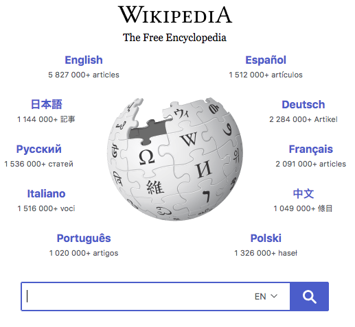

# Vlocity Quality Engineering Take Home Selenium Test #1

This take home test will allow us to evaluate candidates ability to use testNg, Selenium Webdriver, Chrome, Chrome Tools, and Java.
This take home test requires Java 8, Maven 3, and git.  If you need to adapt it to work with your environment, that is ok, just add comments in the files where appropriate.

The candidate will be writing Selenium tests against https://www.wikipedia.org/

## Verify Feature Languages
Tests to verify the "Feature Languages" English, Espanol, etc, all exists with that text.  These are the languages seen in the circle.
	* You should hard code the known language
	* Verify they have hyper links
	* Verify the URL "works" (i.e. do a get and returns 200)
	* Use a dataprovider such that you get a test result for every language

